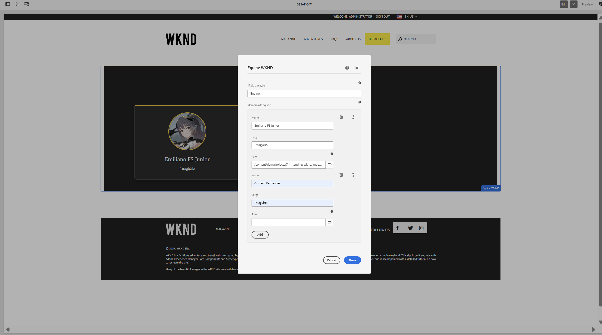
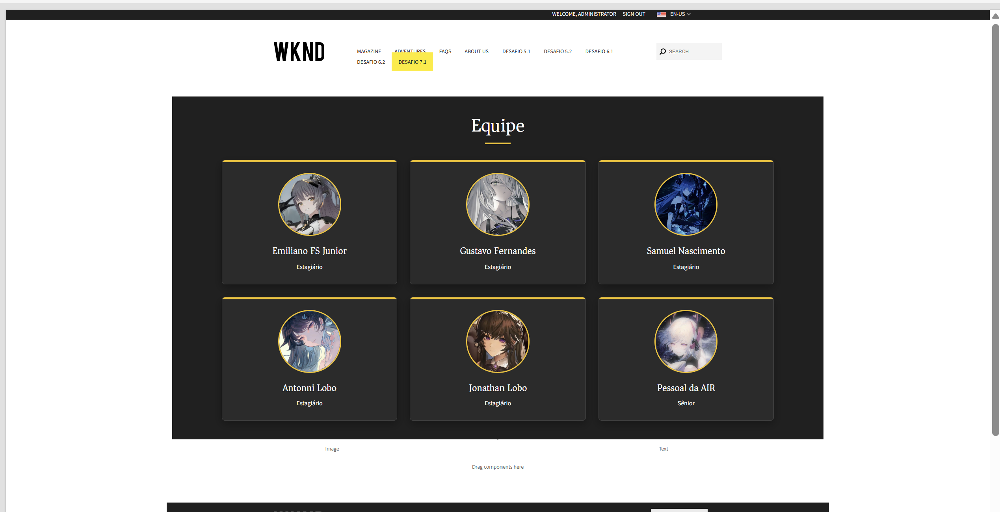
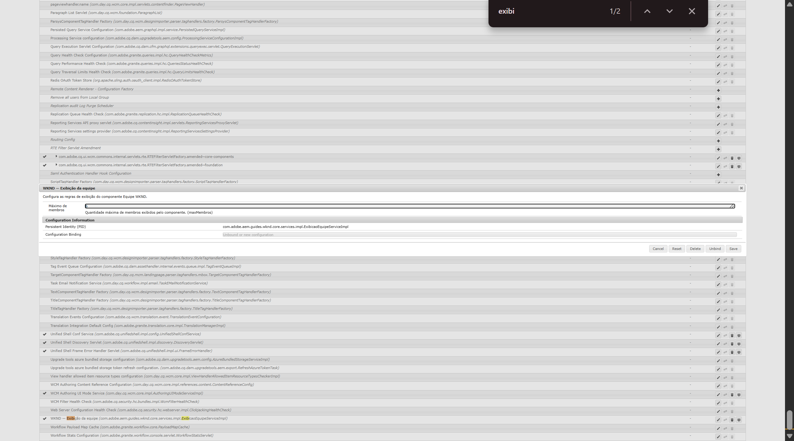
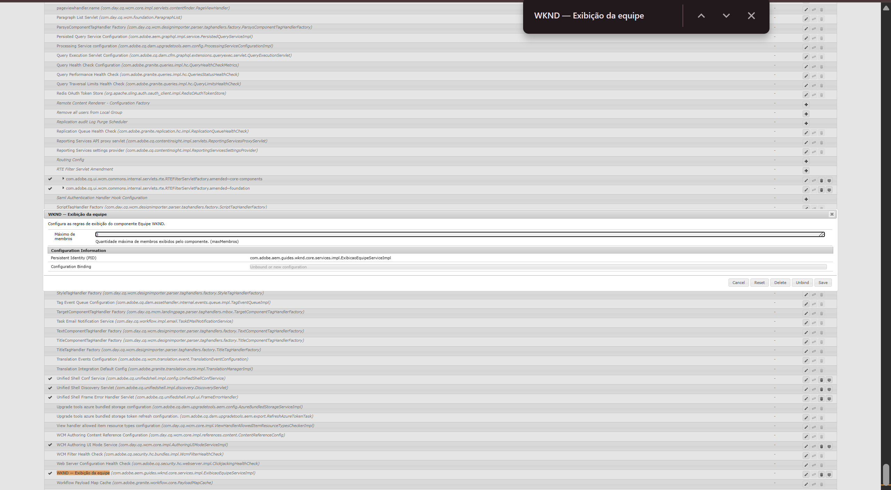
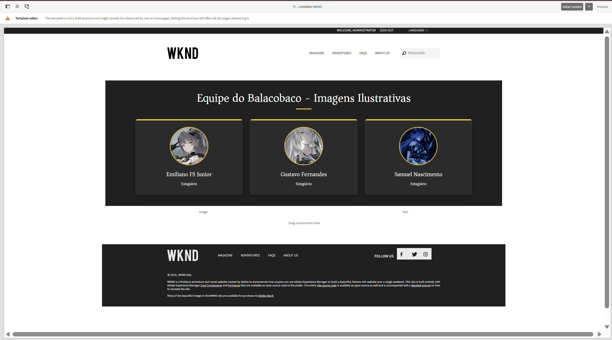
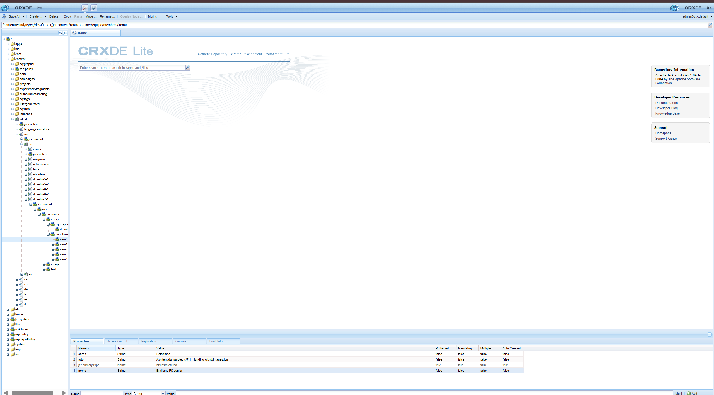
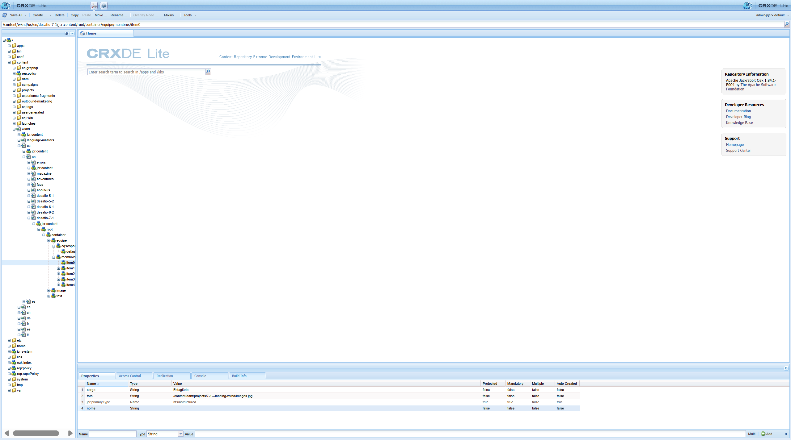
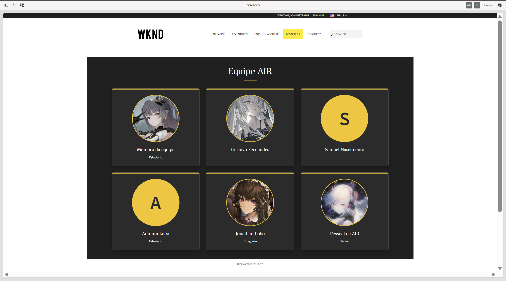

# Desafio 7.1 — Equipe WKND

## Resumo

Implementação do componente autoral **Equipe WKND** para cadastro e exibição de membros de uma equipe no projeto WKND.

O componente utiliza:

- Multifield composto com nome, cargo e foto;
- Sling Models com interfaces e implementações separadas;
- `@ChildResource` para leitura dos membros;
- `data-sly-list` para renderização no HTL;
- serviço OSGi configurável para limitar a quantidade exibida;
- Policy única com Style System;
- tratamento de propriedades ausentes;
- degradação elegante;
- fallback visual para fotos ausentes.

A configuração `maxMembros` pode ser alterada pelo Console OSGi com a página aberta, sem recompilar o projeto e sem realizar novo deploy.

---

## Requisitos atendidos

- [x] Componente `Equipe WKND`
- [x] Multifield composto com nome, cargo e foto
- [x] Persistência dos membros como recursos filhos no JCR
- [x] Leitura da lista com `@ChildResource`
- [x] Renderização com `data-sly-list`
- [x] Serviço `ExibicaoEquipeService`
- [x] Configuração OSGi `maxMembros`
- [x] Injeção do serviço com `@OSGiService`
- [x] Alteração do limite em runtime
- [x] Alteração do limite sem redeploy
- [x] `DefaultInjectionStrategy.OPTIONAL`
- [x] Uso de `@Default` onde aplicável
- [x] Tratamento de lista nula ou vazia
- [x] Degradação elegante após remoção de propriedade no CRXDE
- [x] Policy única vinculada ao template
- [x] Style System para tema, colunas, formato e tamanho da foto
- [x] Build do módulo `core`
- [x] Build completo do projeto
- [x] Evidências em imagens e vídeos
- [ ] Revisão realizada por outro integrante

---

## Estrutura da implementação

### Java

```text
core/src/main/java/com/adobe/aem/guides/wknd/core/
├── config/
│   └── ExibicaoEquipeConfig.java
├── models/
│   ├── Equipe.java
│   ├── MembroEquipe.java
│   └── impl/
│       ├── EquipeImpl.java
│       └── MembroEquipeImpl.java
└── services/
    ├── ExibicaoEquipeService.java
    └── impl/
        └── ExibicaoEquipeServiceImpl.java
```

### Componente AEM

```text
ui.apps/src/main/content/jcr_root/apps/wknd/components/equipe/
├── .content.xml
├── _cq_dialog/
│   └── .content.xml
├── _cq_design_dialog/
│   └── .content.xml
├── clientlibs/
│   ├── .content.xml
│   ├── css.txt
│   ├── js.txt
│   ├── css/
│   │   └── equipe.css
│   └── js/
│       └── equipe.js
└── equipe.html
```

---

## Dialog e Multifield composto

O dialog permite cadastrar vários integrantes dentro do mesmo componente.

Cada item do Multifield possui:

```text
nome
cargo
foto
```

Os membros são armazenados como recursos filhos no JCR:

```text
equipe
└── membros
    ├── item0
    │   ├── nome
    │   ├── cargo
    │   └── foto
    ├── item1
    │   ├── nome
    │   ├── cargo
    │   └── foto
    └── item2
        ├── nome
        ├── cargo
        └── foto
```

Como os integrantes são armazenados como nós filhos, a coleção é injetada no Model principal com:

```java
@ChildResource(name = "membros")
private List<MembroEquipe> membros;
```

O uso de `@ChildResource` representa corretamente a estrutura criada pelo Multifield composto.

---

## Sling Models

### Interface `Equipe`

A interface `Equipe` define o contrato utilizado pelo HTL.

Ela disponibiliza:

- título da seção;
- lista de membros;
- configuração para exibir cargos;
- configuração para exibir fotos.

```java
public interface Equipe {

    String RESOURCE_TYPE = "wknd/components/equipe";

    String getTitulo();

    List<MembroEquipe> getMembros();

    boolean isMostrarCargo();

    boolean isMostrarFoto();
}
```

---

### Implementação `EquipeImpl`

O Model principal é adaptado de:

```java
SlingHttpServletRequest
```

Suas responsabilidades são:

- ler o título do componente;
- injetar a lista de membros;
- injetar o serviço OSGi;
- consultar o limite configurado;
- limitar a quantidade de membros;
- retornar uma lista segura para o HTL;
- consultar na Policy os booleanos `mostrarCargo` e `mostrarFoto`.

Exemplo da injeção dos membros:

```java
@ChildResource(name = "membros")
private List<MembroEquipe> membros;
```

Exemplo da injeção do serviço:

```java
@OSGiService
private ExibicaoEquipeService exibicaoEquipeService;
```

---

### Interface `MembroEquipe`

A interface representa cada membro cadastrado no Multifield.

Ela disponibiliza:

```text
nome
cargo
foto
temCargo
temFoto
inicial
```

A inicial é utilizada no avatar alternativo quando uma foto não foi cadastrada ou não pode ser carregada.

---

### Implementação `MembroEquipeImpl`

Cada integrante é adaptado de:

```java
Resource
```

Essa escolha corresponde à estrutura real do JCR, em que cada item do Multifield é armazenado como um recurso filho dentro do nó `membros`.

---

## Estratégia de injeção

Os Models utilizam:

```java
defaultInjectionStrategy = DefaultInjectionStrategy.OPTIONAL
```

A estratégia opcional permite que o Sling Model continue sendo criado mesmo quando alguma propriedade ou recurso não estiver disponível.

Isso protege cenários como:

- componente recém-adicionado;
- campo opcional não preenchido;
- conteúdo antigo;
- conteúdo incompleto;
- propriedade removida no CRXDE;
- ausência do nó `membros`;
- serviço temporariamente indisponível.

Sem essa proteção, a ausência de uma propriedade poderia impedir a adaptação completa do Model e fazer o componente desaparecer da página.

Foram utilizados injectors específicos:

```text
@ValueMapValue
@ChildResource
@OSGiService
@ScriptVariable
```

O `@Inject` genérico não foi utilizado, pois os injectors específicos deixam clara a origem de cada valor e facilitam a manutenção e o debug.

---

## Valores padrão

### Título

Quando o título está ausente ou vazio, o componente utiliza:

```text
Nossa equipe
```

### Nome

Quando o nome está ausente ou vazio, o membro utiliza:

```text
Membro da equipe
```

### Cargo

Quando o cargo está ausente, o elemento não é renderizado no HTL.

### Foto

Quando a foto está ausente, o componente exibe um avatar contendo a inicial do nome.

---

## Tratamento da lista de membros

O `@ChildResource` pode retornar uma lista nula quando o nó `membros` não existe.

Por isso, o Model trata esse cenário antes de aplicar qualquer operação:

```java
if (membros == null || membros.isEmpty()) {
    return Collections.emptyList();
}
```

O HTL recebe uma lista vazia em vez de um valor nulo.

Esse tratamento evita erros como:

```text
NullPointerException
```

Quando nenhum integrante está cadastrado, o componente continua existindo e exibe uma orientação no modo de edição.

---

## Serviço OSGi

A regra de limite foi separada no serviço:

```text
ExibicaoEquipeService
```

A configuração é declarada em:

```text
ExibicaoEquipeConfig
```

A propriedade:

```text
maxMembros
```

define a quantidade máxima de membros que o componente pode exibir.

---

## Implementação do serviço

A implementação utiliza:

```java
@Component(service = ExibicaoEquipeService.class)
@Designate(ocd = ExibicaoEquipeConfig.class)
```

A configuração é carregada e atualizada com:

```java
@Activate
@Modified
```

Exemplo:

```java
@Activate
@Modified
protected void activate(ExibicaoEquipeConfig config) {
    this.maxMembros = config.maxMembros();
}
```

O uso de `@Modified` permite que a alteração feita no Console OSGi seja aplicada em runtime.

---

## Motivo para utilizar um serviço OSGi

O limite de integrantes não foi fixado dentro do Sling Model.

A separação em um serviço permite:

- alterar o limite sem modificar o código;
- alterar o limite sem recompilar;
- alterar o limite sem realizar novo deploy;
- centralizar a regra de exibição;
- reutilizar a configuração;
- manter o HTL focado apenas na apresentação;
- separar regra de negócio e conteúdo editorial.

---

## Alteração sem redeploy

A configuração pode ser acessada em:

```text
http://localhost:4502/system/console/configMgr
```

Nome apresentado no console:

```text
WKND — Exibição da equipe
```

O teste realizado alterou:

```text
maxMembros: 6 → 3
```

Após salvar a configuração:

1. o container OSGi atualizou a configuração;
2. o método marcado com `@Modified` foi executado;
3. o serviço recebeu o novo limite;
4. o Model passou a retornar somente três membros;
5. a página passou a exibir três membros;
6. nenhum comando Maven foi executado;
7. nenhum novo deploy foi realizado.

---

## Renderização no HTL

O arquivo `equipe.html` percorre os integrantes com:

```html
<sly data-sly-list.membro="${membros}">
```

A regra de limite permanece no backend.

O HTL recebe apenas a lista já preparada pelo Model e fica responsável pela estrutura de apresentação.

A divisão de responsabilidades ficou assim:

```text
Dialog          → cadastro dos membros
JCR             → persistência dos dados
Sling Models    → leitura e preparação
Serviço OSGi    → limite de exibição
Policy          → regras visuais e booleanos
HTL             → estrutura e renderização
Clientlib       → CSS e fallback de imagem
```

---

## Fallback da imagem

O componente possui dois tratamentos para fotos ausentes.

### Foto não cadastrada

Quando a propriedade `foto` não existe, o HTL renderiza um avatar com a inicial do nome.

### Erro ao carregar a imagem

A clientlib JavaScript monitora erros de carregamento.

Quando a imagem não pode ser carregada:

1. a imagem é ocultada;
2. o avatar alternativo é exibido;
3. o restante do card continua funcionando.

Isso evita cards quebrados ou imagens inválidas visíveis na página.

---

## Policy e Style System

Foi mantida apenas uma Policy vinculada ao template:

```text
7.1 Desafio Componente
```

A Policy antiga foi confirmada como não utilizada por outros templates e removida do repositório.

---

### Aparência

A Policy controla:

- Exibir cargo dos membros
- Exibir fotos dos membros

Essas propriedades são lidas pelo Model utilizando:

```java
@ScriptVariable
private Style currentStyle;
```

---

### Style System

O Style System controla:

#### Tema

- Claro
- Escuro
- WKND

#### Colunas

- 2 colunas
- 3 colunas
- 4 colunas

#### Formato da foto

- Circular
- Cantos arredondados
- Quadrada

#### Tamanho da foto

- Pequena
- Média
- Grande

As classes são aplicadas pelo Style System no wrapper externo do componente.

O Model não monta classes CSS de tema, quantidade de colunas, formato ou tamanho da foto.

---

## Separação das configurações

A implementação separa três tipos de responsabilidade:

```text
Conteúdo editorial → Dialog
Apresentação       → Policy e Style System
Regra de limite    → Serviço OSGi
```

Essa divisão evita misturar dados dos integrantes, configurações visuais e regras de negócio.

---

## Decisão sobre delegação

O componente `Equipe WKND` é autoral e não possui um Core Component equivalente cujo contrato pudesse ser estendido de forma natural.

Por isso, o padrão de delegação de Core Components não foi aplicado artificialmente.

Forçar uma delegação sem um supertipo compatível adicionaria complexidade e dependência sem benefício funcional.

A separação entre interfaces e implementações foi utilizada para manter contratos claros e facilitar a manutenção, mas não é apresentada como delegação de um Core Component.

---

## Degradação elegante

Foi realizado um teste removendo uma propriedade diretamente no CRXDE.

Resultado:

- o Sling Model continuou sendo adaptado;
- o componente não desapareceu;
- o integrante continuou sendo exibido;
- os demais dados permaneceram disponíveis;
- o comportamento alternativo foi aplicado;
- nenhuma exceção foi apresentada.

Também existe proteção para:

- propriedade `nome` ausente;
- propriedade `cargo` ausente;
- propriedade `foto` ausente;
- nó `membros` ausente;
- lista de integrantes vazia;
- serviço OSGi indisponível.

---

## Testes realizados

### 1. Multifield composto

Foram cadastrados vários integrantes com nome, cargo e foto.

Resultado:

- os itens foram persistidos abaixo do nó `membros`;
- a lista foi injetada com `@ChildResource`;
- os integrantes foram renderizados com `data-sly-list`.

---

### 2. Limite OSGi sem redeploy

O valor de `maxMembros` foi alterado de `6` para `3` com a página aberta.

Resultado:

- a quantidade exibida mudou;
- não houve novo build;
- não houve instalação de pacote;
- não houve novo deploy.

---

### 3. Propriedade removida no CRXDE

Uma propriedade de um integrante foi removida diretamente no repositório.

Resultado:

- o Model continuou funcionando;
- o componente não desapareceu;
- os demais dados continuaram sendo exibidos;
- o fallback esperado foi aplicado.

---

### 4. Style System

Foram validados:

- temas Claro, Escuro e WKND;
- 2, 3 e 4 colunas;
- fotos circulares;
- fotos com cantos arredondados;
- fotos quadradas;
- tamanhos pequeno, médio e grande.

---

### 5. Limpeza de Policy duplicada

A Policy antiga foi confirmada como não utilizada por nenhum outro template.

Após a exclusão:

- a Policy correta continuou vinculada;
- o template continuou funcionando;
- a página continuou funcionando;
- os estilos permaneceram disponíveis.

---

## Evidências

### Dialog com Multifield



O dialog permite cadastrar vários integrantes, cada um com nome, cargo e foto.

---

### Equipe renderizada



O componente renderiza os integrantes cadastrados no Multifield.

---

### Configuração OSGi antes



Registro do valor inicial de `maxMembros`.

---

### Configuração OSGi depois



Registro da alteração de `maxMembros` pelo Console OSGi.

---

### Resultado após alteração do OSGi



A página passou a respeitar o novo limite sem necessidade de redeploy.

---

### Propriedade antes da remoção



Registro do integrante antes da remoção da propriedade.

---

### Propriedade removida no CRXDE



Registro da propriedade removida diretamente no repositório.

---

### Degradação elegante



O componente continuou funcionando depois da remoção da propriedade.

---

## Evidências em vídeo

### Alteração de `maxMembros` sem redeploy

[Assistir ao vídeo](./7.1-MaxMember-NoRedeploy.mp4)

O vídeo demonstra a alteração no Console OSGi e a atualização da página sem execução de novo deploy.

---

### Degradação elegante após alteração no CRXDE

[Assistir ao vídeo](./7.1-DegradacaoElegante-Crxe.mp4)

O vídeo demonstra a remoção de uma propriedade e o funcionamento do componente após a alteração.

---

## Build e instalação

### Validação do módulo `core`

```bash
mvn -pl core clean verify -DskipTests
```

Resultado:

```text
BUILD SUCCESS
```

---

### Validação completa

```bash
mvn clean verify -DskipTests
```

Resultado:

```text
BUILD SUCCESS
```

---

### Instalação do bundle Java

```bash
mvn -pl core install -PautoInstallBundle -DskipTests
```

---

### Instalação do componente e das clientlibs

```bash
mvn -pl ui.apps install -PautoInstallPackage -DskipTests
```

---

## Resultado final

O componente `Equipe WKND` atende aos critérios obrigatórios do Desafio 7.1:

- Multifield composto;
- leitura dos itens com `@ChildResource`;
- iteração no HTL com `data-sly-list`;
- serviço OSGi configurável;
- alteração de `maxMembros` em runtime;
- alteração sem redeploy;
- injectors opcionais;
- valores padrão;
- tratamento de lista nula ou vazia;
- degradação elegante;
- README com as decisões de injection strategy;
- evidências do funcionamento.

Como complemento, a implementação também possui:

- Policy única;
- Style System;
- temas visuais;
- configuração de colunas;
- configuração de formato e tamanho das fotos;
- fallback visual para imagens ausentes;
- separação entre interfaces e implementações.