# 📰 Desafio 7.2 — Últimas do Magazine

Componente dinâmico desenvolvido para o projeto **WKND**, responsável por consultar e exibir automaticamente as páginas mais recentes do Magazine.

A implementação também disponibiliza os mesmos dados em JSON por meio de:

- **Sling Model Exporter** — `.model.json`;
- **Sling Servlet bônus** — `.ultimas.json`.

---

## 🎯 Objetivo

Criar um componente que deixe de ler apenas suas próprias propriedades e passe a consultar outros conteúdos do repositório AEM.

O componente busca páginas em:

```text
/content/wknd/us/en/magazine
```

Cada resultado apresenta:

- título;
- imagem;
- link funcional para a página;
- fallback visual quando não há imagem.

A quantidade máxima de artigos é configurável pelo autor, com valor padrão igual a `4`.

---

## ✅ Resultado entregue

- [x] Componente `ultimas-do-magazine`;
- [x] consulta com QueryBuilder;
- [x] quantidade configurável no Dialog;
- [x] valor padrão igual a `4`;
- [x] validação entre `1` e `12`;
- [x] ordenação pelas páginas mais recentes;
- [x] título, imagem e link em cada card;
- [x] links direcionando para as páginas corretas;
- [x] fallback para página sem imagem;
- [x] Sling Model Exporter;
- [x] endpoint `.model.json`;
- [x] Servlet bônus por `resourceType`;
- [x] endpoint `.ultimas.json`;
- [x] JSON personalizado no Servlet;
- [x] Query validada no QueryBuilder Debugger;
- [x] uso do índice `cqPageLucene`;
- [x] ausência de traversal;
- [x] Style System com temas e colunas;
- [x] layout responsivo;
- [x] HTML semântico;
- [x] build completo aprovado.

---

# 🧭 Fluxo da implementação

```text
Dialog
  ↓
Quantidade configurada
  ↓
UltimasDoMagazineImpl
  ↓
QueryBuilder
  ↓
Páginas do Magazine
  ↓
ArtigoMagazine
  ├── título
  ├── imagem
  └── link
  ↓
HTL
  ↓
Cards renderizados
```

Os mesmos dados também são reutilizados pelos endpoints:

```text
UltimasDoMagazineImpl
        ├── HTL
        ├── Model Exporter
        └── Sling Servlet
```

A consulta existe em um único lugar, evitando duplicação de lógica.

---

# 📁 Estrutura de arquivos

## Java — módulo `core`

```text
core/src/main/java/com/adobe/aem/guides/wknd/core/
├── models/
│   ├── ArtigoMagazine.java
│   ├── UltimasDoMagazine.java
│   └── impl/
│       └── UltimasDoMagazineImpl.java
└── servlets/
    └── UltimasDoMagazineServlet.java
```

## Componente — módulo `ui.apps`

```text
ui.apps/src/main/content/jcr_root/apps/wknd/components/ultimas-do-magazine/
├── .content.xml
├── _cq_dialog/
│   └── .content.xml
├── _cq_design_dialog/
│   └── .content.xml
├── clientlibs/
│   ├── .content.xml
│   ├── css.txt
│   └── css/
│       └── ultimas-do-magazine.css
└── ultimas-do-magazine.html
```

---

# ☕ Arquitetura Java

A implementação foi dividida em três responsabilidades.

## `UltimasDoMagazine.java`

Interface pública do componente.

```java
public interface UltimasDoMagazine {

    int getQuantidade();

    List<ArtigoMagazine> getArtigos();

    boolean isVazio();
}
```

O HTL e o Servlet dependem desse contrato, sem conhecer diretamente os detalhes da implementação.

---

## `UltimasDoMagazineImpl.java`

Sling Model responsável por:

- ler a quantidade configurada;
- injetar o QueryBuilder;
- montar os predicados;
- executar a consulta;
- transformar cada `Hit` em `Page`;
- extrair título, imagem e link;
- montar a lista de artigos;
- alimentar o HTL;
- alimentar o Model Exporter;
- fornecer os dados ao Servlet.

---

## `ArtigoMagazine.java`

Objeto simples que representa cada resultado.

```text
ArtigoMagazine
├── titulo
├── imagem
└── link
```

Essa decisão evita expor diretamente ao HTL objetos técnicos como:

```text
Hit
Resource
Page
```

O HTL recebe apenas os dados necessários para montar o card.

---

# 💉 Injectors utilizados

## `@ValueMapValue`

Lê a quantidade gravada na instância do componente.

```java
@ValueMapValue
@Default(intValues = QUANTIDADE_PADRAO)
private int quantidade;
```

Fluxo:

```text
Dialog
name="./quantidade"
        ↓
JCR
quantidade = 4
        ↓
@ValueMapValue
        ↓
campo Java
```

---

## `@OSGiService`

Injeta o serviço QueryBuilder fornecido pelo AEM.

```java
@OSGiService
private QueryBuilder queryBuilder;
```

O QueryBuilder recebe os predicados e cria a consulta executada no repositório.

---

## `@SlingObject`

Injeta o `ResourceResolver` da requisição atual.

```java
@SlingObject
private ResourceResolver resourceResolver;
```

O resolver é adaptado para uma `Session` JCR:

```java
Session session =
    resourceResolver.adaptTo(Session.class);
```

Essa Session é utilizada pelo QueryBuilder.

---

## `@ScriptVariable`

Injeta o `PageManager`.

```java
@ScriptVariable
private PageManager pageManager;
```

Ele transforma o caminho retornado pela consulta em uma página AEM:

```text
Hit
 ↓
hit.getPath()
 ↓
PageManager
 ↓
Page
```

Também existe um fallback:

```java
resourceResolver.adaptTo(PageManager.class);
```

---

## `@Default` e estratégia opcional

O Model utiliza:

```java
defaultInjectionStrategy =
    DefaultInjectionStrategy.OPTIONAL
```

Além disso:

- a quantidade possui valor padrão;
- as dependências são verificadas antes do uso;
- a lista começa como `Collections.emptyList()`;
- valores ausentes não causam `NullPointerException`.

Resultado:

```text
Dependência ausente
        ↓
Model continua existindo
        ↓
Lista vazia
        ↓
Componente não derruba a página
```

---

# ⚙️ Ciclo do Sling Model

```text
1. O Sling encontra o resourceType do componente
2. Localiza UltimasDoMagazineImpl
3. Cria a instância
4. Injeta QueryBuilder
5. Injeta ResourceResolver
6. Injeta PageManager
7. Injeta quantidade
8. Aplica o valor padrão
9. Executa o @PostConstruct
10. Entrega os dados ao HTL, Exporter ou Servlet
```

A consulta é executada somente após as injeções, dentro do método marcado com:

```java
@PostConstruct
```

---

# 🧮 Dialog e validação

O Dialog possui o campo:

```text
Quantidade de artigos
```

Configuração:

| Propriedade | Valor |
|---|---:|
| Padrão | `4` |
| Mínimo | `1` |
| Máximo | `12` |
| Passo | `1` |
| Obrigatório | Sim |

Exemplo:

```xml
<quantidade
    sling:resourceType="granite/ui/components/coral/foundation/form/numberfield"
    name="./quantidade"
    fieldLabel="Quantidade de artigos"
    value="{Long}4"
    min="{Long}1"
    max="{Long}12"
    step="{Long}1"
    required="{Boolean}true"/>
```

Foi testada uma tentativa de inserir o valor `20`, e o Dialog bloqueou o salvamento por ultrapassar o máximo permitido.

O backend também trata valores inválidos e utiliza o padrão `4` quando necessário.

---

# 🔎 QueryBuilder

## Query utilizada

```text
path=/content/wknd/us/en/magazine
type=cq:Page
orderby=@jcr:content/jcr:created
orderby.sort=desc
p.limit=4
```

No código, `p.limit` recebe dinamicamente a quantidade configurada pelo autor.

---

## Predicados

| Predicado | Função |
|---|---|
| `path` | Limita a busca à seção Magazine |
| `type` | Retorna somente páginas `cq:Page` |
| `orderby` | Define a propriedade usada na ordenação |
| `orderby.sort` | Ordena da mais recente para a mais antiga |
| `p.limit` | Limita a quantidade máxima de resultados |

Exemplo:

```text
Quantidade configurada: 12
Páginas existentes: 8
Resultados retornados: 8
```

O limite representa o máximo solicitado, não uma obrigação de devolver exatamente aquela quantidade.

---

## Construção da consulta

```java
Map<String, String> predicates =
    new LinkedHashMap<>();
```

```java
Query query = queryBuilder.createQuery(
    PredicateGroup.create(predicates),
    session
);
```

```java
List<Hit> hits =
    query.getResult().getHits();
```

Fluxo:

```text
Predicados
    ↓
PredicateGroup
    ↓
QueryBuilder
    ↓
Query
    ↓
QueryResult
    ↓
Hit
```

---

# 🧪 QueryBuilder Debugger

A consulta foi validada antes de ser utilizada no código.

Ferramenta:

```text
http://localhost:4502/libs/cq/search/content/querydebug.html
```

O Debugger confirmou:

- caminho correto;
- retorno de páginas `cq:Page`;
- ordenação decrescente;
- limite configurável;
- páginas do Magazine retornadas;
- XPath correspondente gerado.

---

# 🚀 Performance e ausência de traversal

O XPath foi analisado no Query Performance:

```text
http://localhost:4502/libs/granite/operations/content/diagnosistools/queryPerformance.html
```

O resultado exibiu:

```text
Indexes Used
cqPageLucene
```

E também:

```text
indexDefinition: /oak:index/cqPageLucene
```

Não apareceram:

```text
TraversalIndex
traverse
traversal
```

Portanto, a consulta utiliza o índice `cqPageLucene` e não percorre manualmente toda a árvore do repositório.

---

# 🔄 Conversão de resultados

Cada resultado segue este fluxo:

```text
Hit
 ↓
hit.getPath()
 ↓
PageManager
 ↓
Page
 ↓
Título, imagem e link
 ↓
ArtigoMagazine
```

## Título

```java
page.getTitle()
```

Quando o título não existe:

```java
page.getName()
```

## Link

```java
page.getPath() + ".html"
```

Exemplo:

```text
/content/wknd/us/en/magazine/western-australia.html
```

Os links foram testados diretamente nos cards e abriram as páginas correspondentes.

## Imagem

A implementação procura a propriedade:

```text
fileReference
```

nos componentes de imagem da página.

Também existe uma busca recursiva limitada para localizar a imagem em estruturas internas diferentes.

---

# 🖼️ Fallback sem imagem

A página `Members Only` não possui imagem localizada pelo componente.

Nesse cenário, o Model retorna:

```json
"imagem": ""
```

O HTL exibe um fallback visual:

```text
WKND
```

Assim, o card continua organizado e o componente não quebra.

---

# 🧱 HTL semântico

O HTL usa a interface:

```html
data-sly-use.model=
    "com.adobe.aem.guides.wknd.core.models.UltimasDoMagazine"
```

A lista é percorrida com:

```html
data-sly-list.artigo="${model.artigos}"
```

Cada item disponibiliza:

```text
artigo.titulo
artigo.imagem
artigo.link
```

A estrutura HTML utiliza:

```html
<section>
<header>
<ul>
<li>
<article>
<a>

<h2>
<h3>
```

Visualmente os artigos formam um grid, mas semanticamente permanecem uma lista de conteúdos relacionados.

---

# 📦 Sling Model Exporter

O Model foi anotado com:

```java
@Exporter(
    name = ExporterConstants.SLING_MODEL_EXPORTER_NAME,
    extensions = ExporterConstants.SLING_MODEL_EXTENSION
)
```

Endpoint:

```text
caminho-do-componente.model.json
```

Exemplo:

```text
/content/wknd/us/en/desafio-7-2/jcr:content/root/container/ultimas_do_magazine.model.json
```

Resposta:

```json
{
  "quantidade": 12,
  "artigos": [
    {
      "titulo": "Western Australia",
      "imagem": "/content/dam/wknd-shared/en/magazine/western-australia/adobestock-156407519.jpeg",
      "link": "/content/wknd/us/en/magazine/western-australia.html"
    }
  ],
  "vazio": false
}
```

O Exporter serializa automaticamente:

```text
getQuantidade()
getArtigos()
isVazio()
```

---

# 🌐 Servlet bônus

Foi criado um Sling Servlet registrado pelo `resourceType` do componente.

```java
@Component(service = Servlet.class)
@SlingServletResourceTypes(
    resourceTypes = "wknd/components/ultimas-do-magazine",
    selectors = "ultimas",
    extensions = "json",
    methods = HttpConstants.METHOD_GET
)
```

Endpoint:

```text
caminho-do-componente.ultimas.json
```

Exemplo:

```text
/content/wknd/us/en/desafio-7-2/jcr:content/root/container/ultimas_do_magazine.ultimas.json
```

---

## Reutilização do Model

O Servlet adapta a requisição para a mesma interface:

```java
UltimasDoMagazine model =
    request.adaptTo(UltimasDoMagazine.class);
```

Arquitetura:

```text
HTL ─────────────┐
Model Exporter ──┼── UltimasDoMagazineImpl
Servlet ─────────┘             ↓
                          QueryBuilder
```

O Servlet não repete os predicados nem possui uma segunda implementação da consulta.

---

## Resposta personalizada

```json
{
  "origem": "Sling Servlet",
  "endpoint": "ultimas",
  "recurso": "/content/wknd/us/en/desafio-7-2/jcr:content/root/container/ultimas_do_magazine",
  "limiteConfigurado": 12,
  "totalRetornado": 8,
  "vazio": false,
  "itens": [
    {
      "titulo": "Western Australia",
      "imagem": "/content/dam/wknd-shared/en/magazine/western-australia/adobestock-156407519.jpeg",
      "link": "/content/wknd/us/en/magazine/western-australia.html"
    }
  ]
}
```

O Servlet também controla:

- status HTTP;
- codificação UTF-8;
- tipo de conteúdo;
- estrutura da resposta;
- mensagem de erro;
- metadados do endpoint.

---

# ⚖️ Exporter × Servlet

| Model Exporter | Sling Servlet |
|---|---|
| Serialização automática | Resposta controlada manualmente |
| Estrutura baseada nos getters | Estrutura JSON personalizada |
| Pouco código | Maior flexibilidade |
| Ideal para representar um componente | Ideal para um endpoint com comportamento próprio |
| Integração natural com soluções headless | Permite status, headers, parâmetros e validações |

## Quando usar o Exporter?

Quando o JSON deve representar diretamente os dados públicos do componente.

```text
componente.model.json
```

## Quando usar o Servlet?

Quando o endpoint precisa de:

- estrutura própria;
- metadados;
- validações;
- parâmetros;
- status HTTP específicos;
- tratamento de erro personalizado.

```text
componente.ultimas.json
```

## Decisão adotada

O Exporter retorna diretamente:

```json
{
  "quantidade": 12,
  "artigos": [],
  "vazio": false
}
```

O Servlet retorna:

```json
{
  "origem": "Sling Servlet",
  "endpoint": "ultimas",
  "limiteConfigurado": 12,
  "totalRetornado": 8,
  "itens": []
}
```

Os dois utilizam a mesma lista produzida pelo Sling Model.

---

# 🎨 Style System

O `_cq_design_dialog` inclui a aba oficial do Style System:

```xml
<styles
    jcr:primaryType="nt:unstructured"
    sling:resourceType="granite/ui/components/coral/foundation/include"
    path="/mnt/overlay/cq/gui/components/authoring/dialog/style/tab_design/styletab"/>
```

A divisão adotada foi:

```text
Dialog
→ quantidade e comportamento da consulta

Style System
→ aparência do componente
```

---

## Temas

```text
tema-ultimas-magazine-claro
tema-ultimas-magazine-escuro
tema-ultimas-magazine-wknd
```

## Colunas

```text
coluna-ultimas-magazine--colunas-2
coluna-ultimas-magazine--colunas-3
coluna-ultimas-magazine--colunas-4
```

Exemplos de combinação:

```text
Tema escuro + 3 colunas
Tema claro + 4 colunas
Tema WKND + 2 colunas
```

---

## Responsividade

```text
Desktop
→ quantidade definida na Policy

Tablet
→ no máximo 2 colunas

Celular
→ 1 coluna
```

Também foi implementado:

```css
@media (prefers-reduced-motion: reduce)
```

Isso reduz animações para usuários que possuem essa preferência configurada.

---

# 🧪 Testes realizados

| Teste | Resultado |
|---|---|
| Instância nova | Quantidade padrão `4` |
| Quantidade alterada | Lista atualizada dinamicamente |
| Valor `20` | Dialog impediu o salvamento |
| Página sem imagem | Fallback `WKND` |
| Clique nos cards | Página correta aberta |
| `.model.json` | JSON do Model retornado |
| `.ultimas.json` | JSON personalizado retornado |
| Query Debugger | Resultados corretos |
| Query Performance | Índice `cqPageLucene` |
| Traversal | Não encontrado |
| Style System | Temas e colunas funcionando |
| Build Maven | `BUILD SUCCESS` |

---

# 📸 Evidências

## 🔎 QueryBuilder Debugger

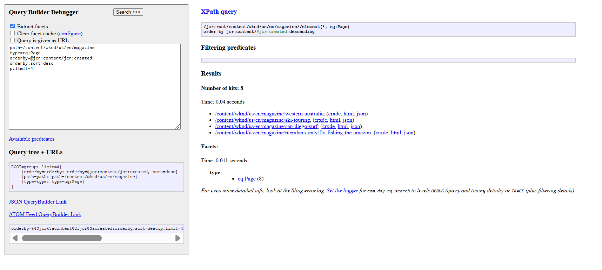

---

## 🚀 Explain Query — `cqPageLucene`

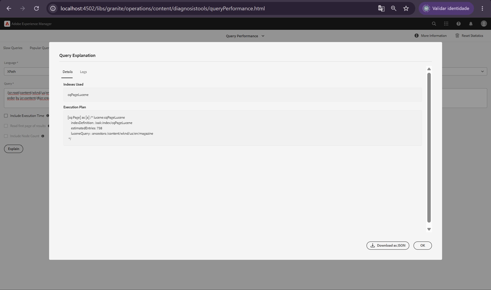

---

## 🔢 Dialog com valor padrão `4`

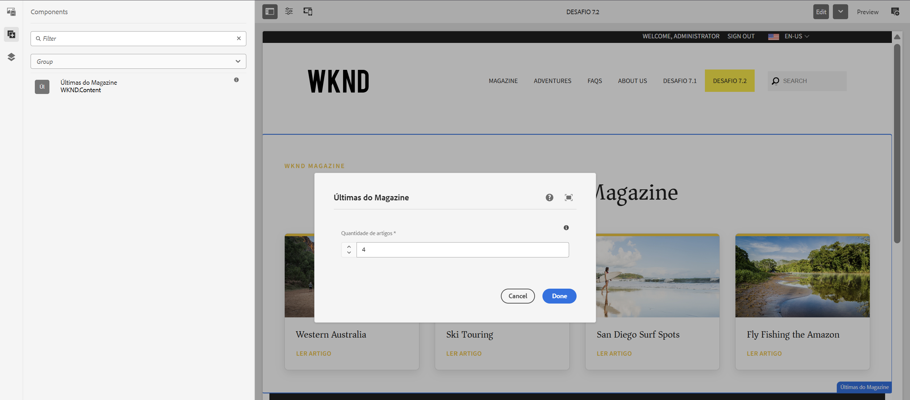

---

## 📰 Componente com quatro artigos

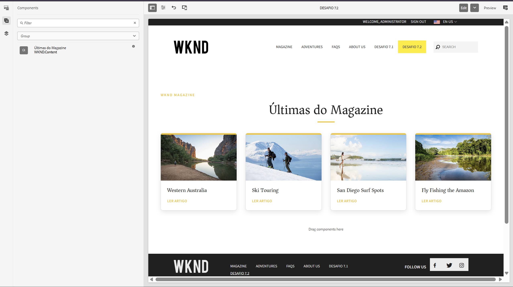

---

## ✏️ Quantidade alterada

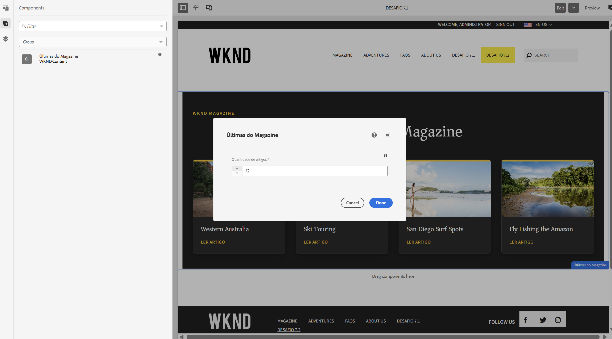

---

## 🛡️ Validação do limite máximo

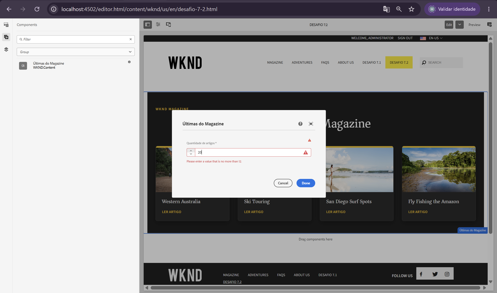

---

## 🔄 Lista dinâmica

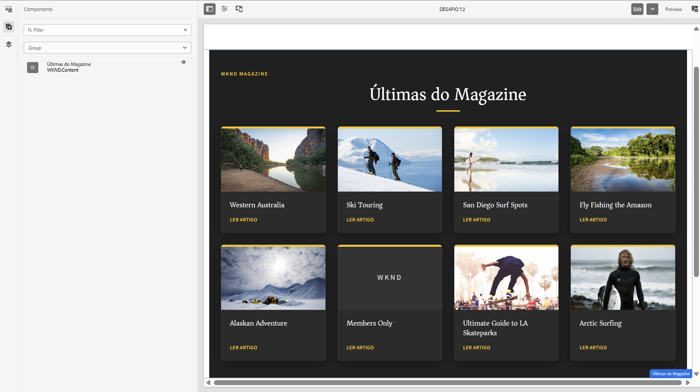

---

## 🖼️ Fallback sem imagem

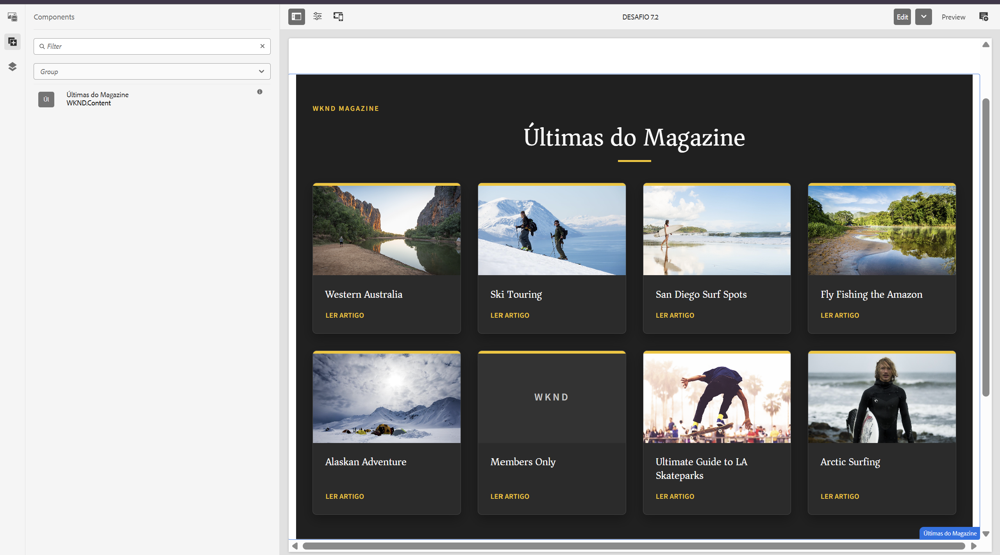

---

## 📦 Model Exporter

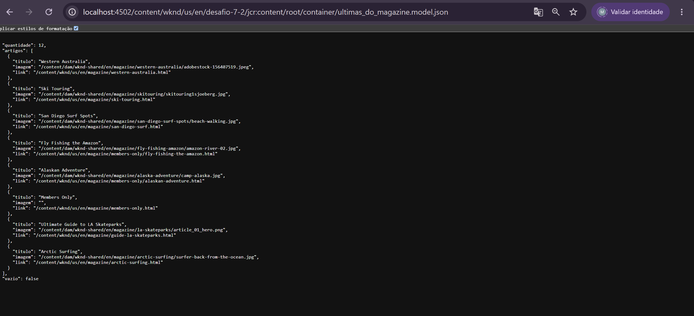

---

## 🌐 Servlet bônus

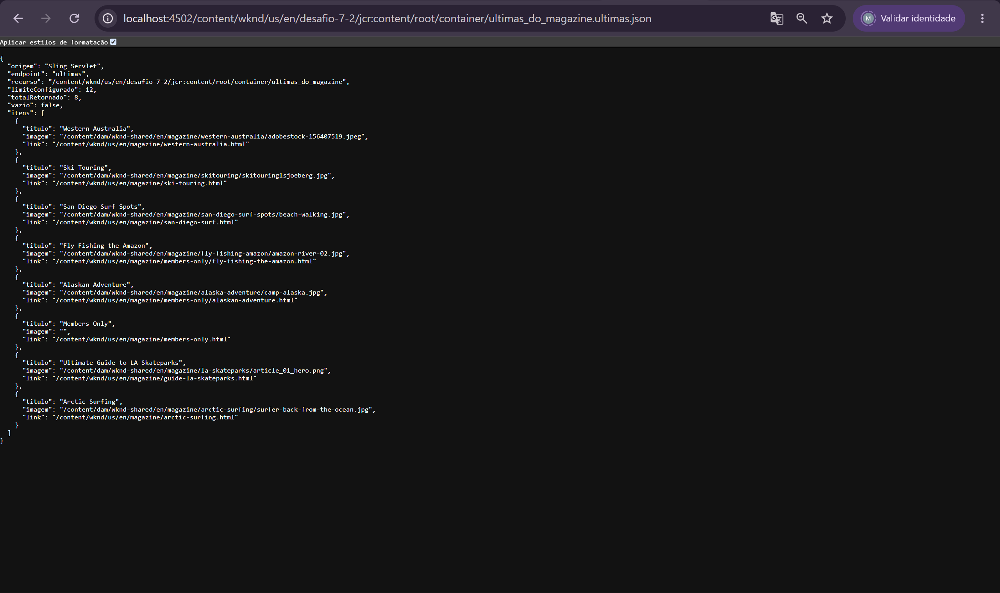

---

## 🎨 Style System

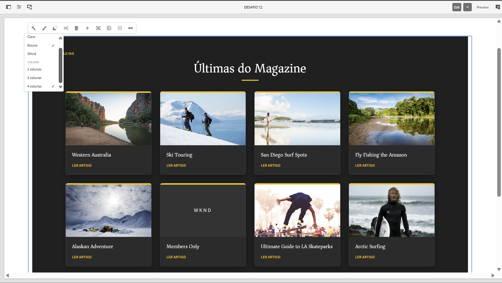

---

# 🎥 Vídeos

## Demonstração completa

Apresenta:

- componente no AEM;
- Dialog;
- alteração da quantidade;
- Style System;
- CRXDE;
- QueryBuilder Debugger;
- Query Performance;
- Model Exporter;
- Servlet bônus.

[▶️ Assistir ao vídeo demonstrativo](./7.2-video-demonstrativo.mp4)

---

## Demonstração dos links

Comprova que os cards possuem links funcionais e direcionam o usuário para a página correta do Magazine.

[🔗 Assistir à demonstração dos links](./7.2-video-demonstracao-link.mp4)

---

# 🏗️ Validação do projeto

## Compilação do `core`

```bash
mvn -pl core package -DskipTests
```

## Compilação de `core` e `ui.apps`

```bash
mvn -pl core,ui.apps -am package -DskipTests
```

## Validação completa

```bash
mvn verify -DskipTests
```

Resultado:

```text
BUILD SUCCESS
```

---

# 💡 Principais decisões técnicas

| Decisão | Motivo |
|---|---|
| Interface separada da implementação | Reduzir acoplamento |
| `ArtigoMagazine` como DTO | Não expor objetos internos do AEM |
| Query centralizada no Model | Evitar duplicação |
| Injectors específicos | Deixar clara a origem dos dados |
| `OPTIONAL` e `@Default` | Evitar que o componente desapareça |
| Style System para aparência | Separar visual da lógica |
| Servlet por `resourceType` | Associar o endpoint ao recurso |
| Exporter e Servlet usando o mesmo Model | Manter uma única fonte de verdade |
| Query validada no Query Performance | Evitar traversal |
| Fallback visual | Manter o layout estável sem imagem |

---

# 🏁 Critérios de aceite

## Obrigatórios

- [x] Lista dinâmica funcionando;
- [x] quantidade configurável pelo autor;
- [x] valor padrão igual a `4`;
- [x] busca em `/content/wknd/us/en/magazine`;
- [x] páginas mais recentes primeiro;
- [x] título exibido;
- [x] imagem exibida;
- [x] link funcional;
- [x] Query validada no QueryBuilder Debugger;
- [x] Query documentada;
- [x] resultado do Debugger documentado;
- [x] Model anotado com `@Exporter`;
- [x] `.model.json` respondendo;
- [x] build completo aprovado.

## Bônus

- [x] Servlet registrado por `resourceType`;
- [x] seletor `ultimas`;
- [x] extensão `json`;
- [x] método GET;
- [x] mesma lista reutilizada;
- [x] JSON personalizado;
- [x] tratamento de erro;
- [x] comparação Exporter × Servlet.

## Melhorias adicionais

- [x] validação entre `1` e `12`;
- [x] fallback sem imagem;
- [x] HTML semântico;
- [x] Style System;
- [x] temas Claro, Escuro e WKND;
- [x] opções de 2, 3 e 4 colunas;
- [x] responsividade;
- [x] preferência por movimento reduzido;
- [x] índice `cqPageLucene`;
- [x] ausência de traversal;
- [x] vídeos de demonstração;
- [x] comprovação dos links funcionais.