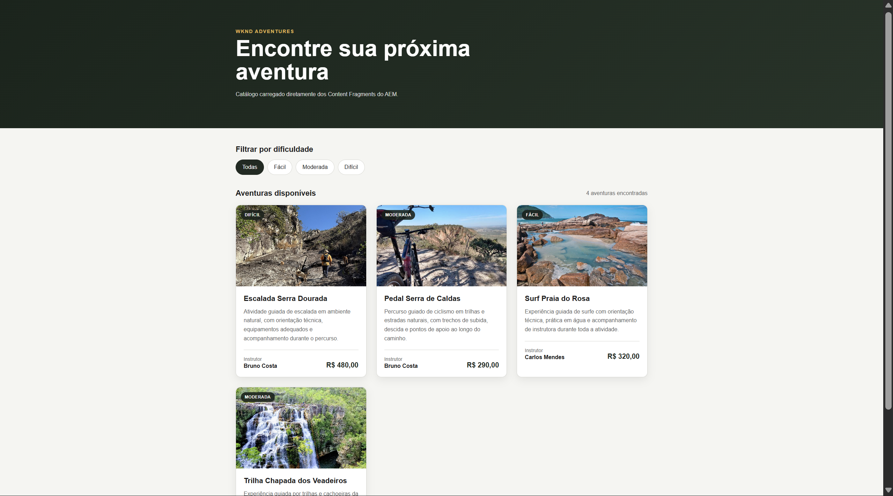
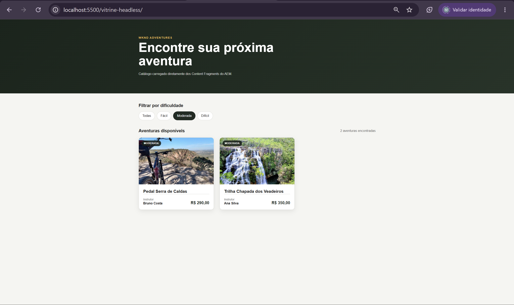
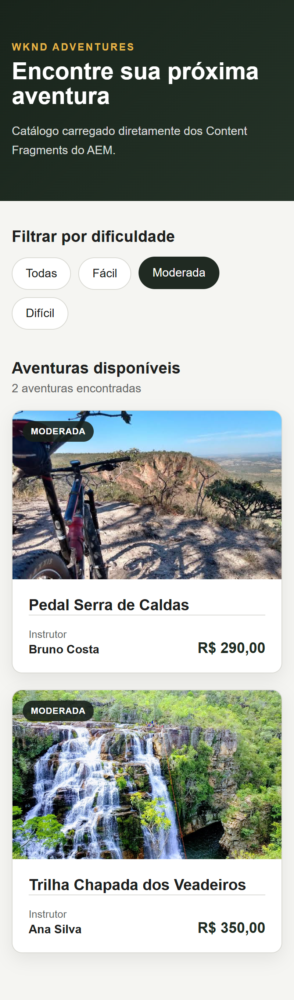
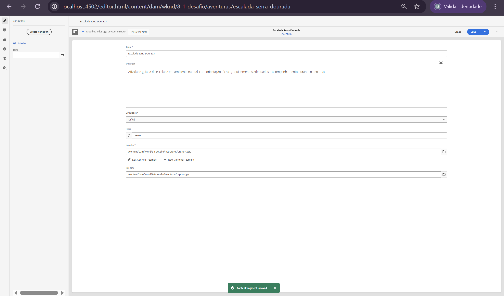
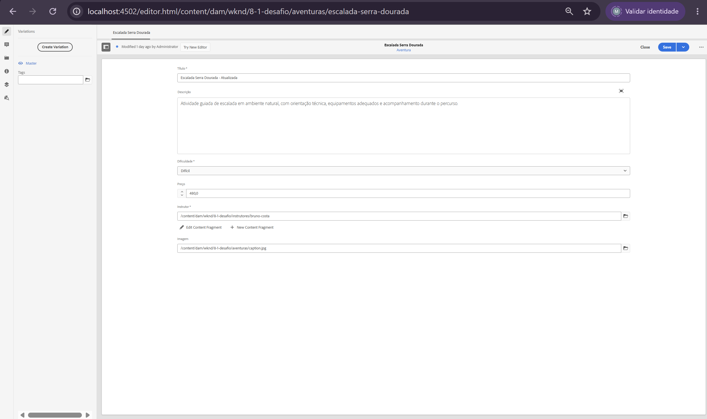
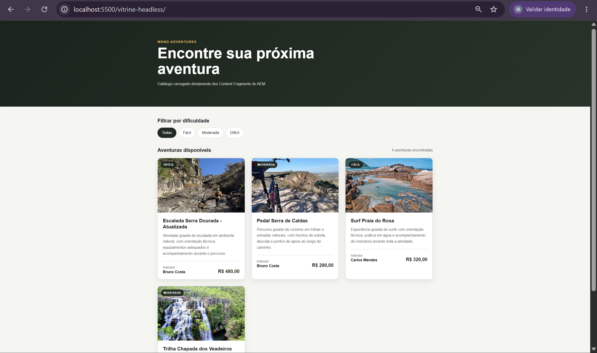

# Desafio 8.2 — Vitrine Headless de Aventuras

## Checklist dos requisitos

- [x] Aplicação externa criada fora da renderização do AEM
- [x] Desenvolvimento com HTML, CSS e JavaScript puro
- [x] Consumo de dados reais dos Content Fragments do AEM
- [x] Uso de Persisted Query por requisição HTTP GET
- [x] Cards com imagem, título, dificuldade, preço e instrutor
- [x] Filtro por dificuldade disponível na interface
- [x] Filtro enviado como parâmetro na URL da Persisted Query
- [x] Nenhuma query GraphQL montada por concatenação no cliente
- [x] Layout mobile-first
- [x] Grid responsivo para celular, tablet e desktop
- [x] Estados de carregamento, erro e ausência de resultados
- [x] Ciclo de atualização do Content Fragment refletido no aplicativo
- [x] Evidências da aplicação, filtro, responsividade e atualização

---

## Resumo

O Desafio 8.2 implementa uma aplicação headless externa responsável por consumir e apresentar o catálogo de aventuras modelado no Desafio 8.1.

A vitrine foi construída com:

```text
HTML
CSS
JavaScript puro
```

A aplicação não utiliza HTL, Sling Model ou componentes AEM. O AEM atua como CMS headless, entregando os dados estruturados através de Persisted Queries GraphQL.

---

## Branch

```text
exercicio/8.2-vitrine-headless
```

---

## Estrutura da aplicação

A aplicação foi criada na raiz do projeto, separada dos módulos instalados no AEM:

```text
vitrine-headless/
├── index.html
├── styles.css
└── app.js
```

Essa separação representa o cenário headless: o front-end possui sua própria camada de apresentação e utiliza o AEM somente como fonte de conteúdo.

---

## Arquitetura

```text
Content Fragments no AEM
          │
          ▼
Persisted Queries GraphQL
          │
          ▼
Resposta JSON por HTTP GET
          │
          ▼
Aplicação HTML + CSS + JavaScript
          │
          ▼
Cards de aventuras no navegador
```

No ambiente local, a aplicação foi executada através do Live Server e consumiu o AEM Author em:

```text
http://localhost:4502
```

A vitrine foi disponibilizada em:

```text
http://localhost:5500/vitrine-headless/
```

Em um ambiente de produção, o consumidor deve acessar o AEM Publish, com o conteúdo devidamente publicado.

---

## Persisted Queries utilizadas

### Listagem completa

```text
/graphql/execute.json/wknd/aventurasList
```

Essa consulta retorna todas as Aventuras e os campos necessários para a montagem dos cards.

### Listagem filtrada

```text
/graphql/execute.json/wknd/aventurasListDificuldade
```

O filtro é enviado como parâmetro da própria Persisted Query.

Exemplo:

```text
/graphql/execute.json/wknd/aventurasListDificuldade;dificuldade=moderada
```

Também podem ser utilizados:

```text
;dificuldade=facil
;dificuldade=dificil
```

O JavaScript não monta nem envia documentos GraphQL. Ele apenas escolhe qual Persisted Query será executada e adiciona o valor do filtro à URL.

---

## Dados renderizados

Cada card apresenta:

- imagem;
- título;
- dificuldade;
- descrição, quando disponível na consulta;
- preço formatado em real;
- nome do instrutor.

O caminho da imagem é retornado pelo GraphQL através de:

```graphql
imagem {
  ... on ImageRef {
    _path
  }
}
```

A aplicação combina o host do AEM com o caminho recebido:

```text
http://localhost:4502
+
/content/dam/wknd/...
```

---

## Filtro por dificuldade

A interface possui os filtros:

```text
Todas
Fácil
Moderada
Difícil
```

Ao selecionar `Todas`, a aplicação executa a Persisted Query de listagem completa.

Ao selecionar uma dificuldade, a aplicação executa a Persisted Query parametrizada.

Exemplo para `Moderada`:

```text
http://localhost:4502/graphql/execute.json/wknd/aventurasListDificuldade;dificuldade=moderada
```

O teste retornou somente:

```text
Pedal Serra de Caldas
Trilha Chapada dos Veadeiros
```

O contador da interface também foi atualizado de quatro para duas aventuras.

---

## Responsividade

O CSS foi desenvolvido utilizando abordagem mobile-first.

O comportamento do grid é:

```text
Celular  → 1 card por linha
Tablet   → 2 cards por linha
Desktop  → 3 cards por linha
```

As alterações de layout são realizadas com media queries nativas do CSS.

```css
.adventures-grid {
  grid-template-columns: 1fr;
}

@media (min-width: 640px) {
  .adventures-grid {
    grid-template-columns: repeat(2, minmax(0, 1fr));
  }
}

@media (min-width: 960px) {
  .adventures-grid {
    grid-template-columns: repeat(3, minmax(0, 1fr));
  }
}
```

Os filtros também utilizam quebra de linha, evitando rolagem horizontal em telas menores.

---

## Decisões técnicas

### Aplicação externa

A vitrine foi mantida fora de `ui.apps`, `ui.content` e dos demais módulos do AEM.

Isso garante que a apresentação não dependa da renderização de páginas ou componentes AEM.

### Persisted Query

A aplicação utiliza Persisted Queries porque as consultas ficam armazenadas e validadas no servidor.

O cliente envia somente uma requisição GET para uma URL conhecida, sem transportar o documento GraphQL.

### Filtro por parâmetro

O valor da dificuldade é enviado através da URL:

```text
;dificuldade=moderada
```

Essa abordagem evita montar queries por concatenação de strings no JavaScript.

### Conteúdo dinâmico

Nenhuma aventura foi escrita manualmente no HTML.

Os cards são construídos dinamicamente a partir do JSON retornado pelo AEM.

### Tratamento de falhas

O JavaScript possui tratamento para:

- carregamento;
- erro HTTP;
- erro retornado pelo GraphQL;
- lista vazia;
- imagem ausente;
- título ausente;
- instrutor ausente;
- preço inválido.

### Segurança da renderização

Os textos recebidos da API são tratados antes de serem inseridos no HTML, reduzindo o risco de conteúdo ser interpretado como marcação indevida.

---

# Evidências

## 1. Aplicação externa em desktop

A vitrine foi executada pelo Live Server e carregou quatro Aventuras diretamente dos Content Fragments do AEM.

Os cards apresentam imagem, título, dificuldade, descrição, preço e nome do Instrutor.



---

## 2. Filtro por dificuldade

O filtro `Moderada` executou a Persisted Query parametrizada e retornou somente as duas Aventuras correspondentes.

O botão ativo e o contador de resultados também foram atualizados.



---

## 3. Layout mobile-first

A aplicação foi validada em largura de celular.

Os cards foram reorganizados em uma única coluna, enquanto os filtros quebraram de linha sem gerar rolagem horizontal.



---

## 4. Estado anterior à atualização

Antes da edição do Content Fragment, o card apresentava o título original:

```text
Escalada Serra Dourada
```



---

## 5. Content Fragment atualizado no AEM

O Content Fragment foi editado no AEM Author, alterando o título para:

```text
Escalada Serra Dourada - Atualizada
```



---

## 6. Atualização refletida na aplicação

Após salvar o Content Fragment e recarregar a aplicação, o novo título apareceu no card sem qualquer alteração no HTML ou no JavaScript.

Isso comprova o fluxo:

```text
editar o Content Fragment
→ salvar/atualizar no AEM
→ recarregar a aplicação externa
→ conteúdo atualizado na tela
```



---

## 7. Demonstração em vídeo

O vídeo apresenta a alteração do Content Fragment e o conteúdo sendo atualizado na aplicação externa.

[▶ Assistir à demonstração do ciclo headless](./evidencias/8.2-mudando-fragment.mp4)

---

## Resultado

A implementação comprova o funcionamento do AEM como CMS headless.

O conteúdo permanece modelado e administrado através dos Content Fragments, enquanto a aplicação externa controla integralmente sua apresentação.

A vitrine:

- consome dados reais do AEM;
- utiliza Persisted Queries;
- filtra através de parâmetro na URL;
- não monta queries GraphQL no cliente;
- apresenta layout responsivo;
- reflete alterações realizadas no conteúdo;
- permanece independente da renderização tradicional de páginas AEM.