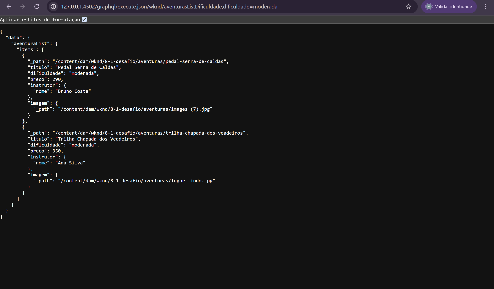
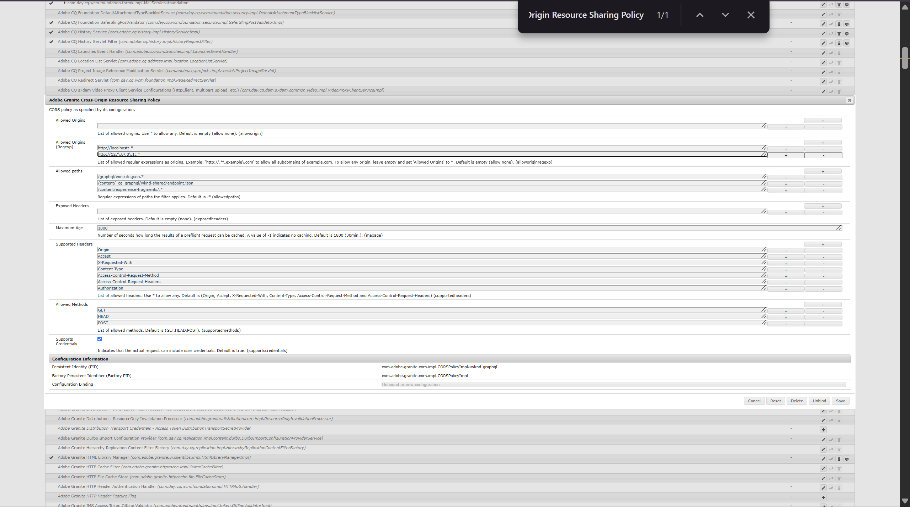

# Desafio 8.2 — Vitrine Headless de Aventuras

## Checklist dos requisitos

- [x] Aplicação externa e independente da renderização do AEM
- [x] Desenvolvimento com HTML, CSS e JavaScript puro
- [x] Nenhum framework utilizado
- [x] Consumo de dados reais dos Content Fragments do AEM
- [x] Uso de Persisted Queries por requisição HTTP GET
- [x] Cards com imagem, título, dificuldade, preço e nome do instrutor
- [x] Filtro por dificuldade disponível na interface
- [x] Filtro enviado como parâmetro na URL da Persisted Query
- [x] Nenhum documento GraphQL montado no cliente
- [x] Layout desenvolvido com abordagem mobile-first
- [x] Grid responsivo para celular, tablet e desktop
- [x] Estados de carregamento, erro e ausência de resultados
- [x] JavaScript separado por responsabilidades
- [x] CSS separado entre variáveis e estilos principais
- [x] Política CORS configurada para o consumo externo
- [x] Ciclo de atualização do Content Fragment refletido na aplicação
- [x] Evidências da aplicação, filtro, URL parametrizada, CORS, responsividade e atualização

---

## Resumo

O Desafio 8.2 implementa uma aplicação headless externa responsável por consumir e apresentar o catálogo de aventuras criado no Desafio 8.1.

A aplicação foi desenvolvida utilizando:

```text
HTML
CSS
JavaScript puro
```

Não foram utilizados frameworks, HTL, Sling Models ou componentes AEM para renderizar a interface.

O AEM atua como CMS headless, mantendo os dados estruturados nos Content Fragments e disponibilizando essas informações por meio de Persisted Queries GraphQL.

A aplicação externa controla integralmente a apresentação dos dados recebidos.

---

## Branch

```text
exercicio/8.2-vitrine-headless
```

---

## Estrutura da aplicação

A aplicação foi criada na raiz do repositório, fora dos módulos responsáveis pela renderização tradicional do AEM:

```text
vitrine-headless/
├── css/
│   ├── variables.css
│   └── styles.css
├── js/
│   ├── api.js
│   ├── app.js
│   ├── components.js
│   └── config.js
└── index.html
```

Essa separação representa o cenário headless: o front-end possui sua própria camada de apresentação e utiliza o AEM somente como fonte de conteúdo estruturado.

---

## Organização do JavaScript

O JavaScript foi dividido por responsabilidade para facilitar a leitura, manutenção e evolução da aplicação.

### `config.js`

Centraliza:

- host do AEM;
- caminhos das Persisted Queries;
- rótulos das dificuldades.

O ambiente local da aplicação foi padronizado para utilizar o endereço de loopback `127.0.0.1`:

```javascript
export const AEM_HOST = "http://127.0.0.1:4502";

export const ENDPOINTS = {
  aventuras: "/graphql/execute.json/wknd/aventurasList",
  aventurasPorDificuldade:
    "/graphql/execute.json/wknd/aventurasListDificuldade",
};

export const DIFFICULTY_LABELS = {
  facil: "Fácil",
  moderada: "Moderada",
  dificil: "Difícil",
};
```

O front-end e o AEM utilizam o mesmo hostname:

```text
Front-end:
http://127.0.0.1:5500/vitrine-headless/

AEM Author:
http://127.0.0.1:4502
```

Essa padronização evita problemas de autenticação, cookies e CORS causados pela mistura entre `localhost` e `127.0.0.1`.

### `api.js`

Responsável por:

- montar a URL da Persisted Query;
- adicionar o parâmetro de dificuldade;
- executar a requisição HTTP GET;
- cancelar uma requisição anterior quando necessário;
- validar o status HTTP;
- validar erros retornados pelo GraphQL;
- devolver a lista de aventuras recebida do AEM.

O arquivo importa as configurações de `config.js`:

```javascript
import { AEM_HOST, ENDPOINTS } from "./config.js";
```

### `components.js`

Responsável por:

- transformar os dados recebidos do AEM em cards HTML;
- formatar os preços em real;
- converter os valores de dificuldade em rótulos;
- tratar propriedades ausentes;
- montar as URLs das imagens do DAM;
- escapar textos recebidos antes de inseri-los no HTML.

### `app.js`

Responsável por:

- selecionar os elementos da interface;
- controlar os botões de filtro;
- apresentar estados de carregamento e erro;
- renderizar os cards;
- atualizar o contador de resultados;
- inicializar a aplicação.

O arquivo principal importa somente as funções necessárias:

```javascript
import { fetchAdventures } from "./api.js";
import { createAdventureCard } from "./components.js";
```

O JavaScript é carregado no HTML como módulo:

```html
<script type="module" src="./js/app.js"></script>
```

---

## Organização do CSS

Os estilos foram separados por responsabilidade:

```text
css/
├── variables.css
└── styles.css
```

### `variables.css`

Centraliza:

- cores;
- largura máxima do conteúdo;
- raio das bordas;
- sombra dos cards.

Exemplo:

```css
:root {
  --color-background: #f5f5f2;
  --color-surface: #ffffff;
  --color-text: #1f1f1f;
  --color-muted: #666666;
  --color-border: #d8d8d2;
  --color-primary: #202a22;
  --color-primary-hover: #344438;
  --color-accent: #e6b44a;

  --container-width: 1180px;
  --border-radius: 14px;
  --shadow-card: 0 8px 24px rgba(0, 0, 0, 0.08);
}
```

### `styles.css`

Contém:

- estilos globais;
- cabeçalho;
- filtros;
- estados da aplicação;
- cards;
- grid;
- media queries;
- comportamento responsivo.

Os arquivos são carregados nesta ordem:

```html
<link rel="stylesheet" href="./css/variables.css">
<link rel="stylesheet" href="./css/styles.css">
```

O arquivo de variáveis é carregado primeiro porque seus valores são utilizados pelo CSS principal.

---

## Arquitetura

```text
Content Fragments no AEM
          │
          ▼
Persisted Queries GraphQL
          │
          ▼
Resposta JSON por HTTP GET
          │
          ▼
api.js
          │
          ▼
components.js
          │
          ▼
app.js
          │
          ▼
Cards renderizados no navegador
```

O HTML não contém aventuras escritas manualmente.

Todos os cards são construídos dinamicamente a partir dos dados retornados pelo AEM.

---

## Ambiente local

Durante os testes, a aplicação externa foi executada por um servidor local de desenvolvimento na porta `5500`.

A vitrine foi acessada em:

```text
http://127.0.0.1:5500/vitrine-headless/
```

O AEM Author foi acessado em:

```text
http://127.0.0.1:4502
```

O front-end foi padronizado para utilizar somente `127.0.0.1` durante o desenvolvimento local.

Essa decisão evita misturar hostnames diferentes durante:

- autenticação no AEM;
- envio de cookies;
- execução das Persisted Queries;
- carregamento das imagens do DAM;
- aplicação das regras de CORS.

As requisições feitas pelo front-end utilizam:

```javascript
credentials: "include"
```

Isso permite utilizar a sessão autenticada do AEM Author no ambiente local.

Em um ambiente de produção, a aplicação deve consumir o AEM Publish, com o conteúdo devidamente publicado, em vez de consumir diretamente o Author.

---

## Configuração de CORS

Como a aplicação é executada fora do AEM, foi necessária uma política de Cross-Origin Resource Sharing.

A configuração está localizada em:

```text
ui.config/src/main/content/jcr_root/apps/wknd/osgiconfig/config.author/
└── com.adobe.granite.cors.impl.CORSPolicyImpl~wknd.cfg.json
```

A origem utilizada pelo front-end neste desafio é:

```text
http://127.0.0.1:5500
```

A expressão regular que permite o acesso pela aplicação local é:

```text
http://127\.0\.0\.1:.*
```

A política também contém compatibilidade com `localhost`, mas o front-end deste desafio foi padronizado para utilizar `127.0.0.1`.

O caminho autorizado para a execução das Persisted Queries é:

```text
/graphql/execute.json.*
```

Os métodos necessários incluem:

```text
GET
HEAD
POST
```

A opção de suporte a credenciais foi mantida ativa para permitir o uso da sessão autenticada do AEM Author durante o desenvolvimento.

---

## Persisted Queries utilizadas

### Listagem completa

```text
/graphql/execute.json/wknd/aventurasList
```

Essa Persisted Query retorna todas as aventuras e os campos necessários para a montagem dos cards.

### Listagem filtrada

```text
/graphql/execute.json/wknd/aventurasListDificuldade
```

O filtro é enviado como parâmetro na própria URL da Persisted Query.

Exemplo:

```text
/graphql/execute.json/wknd/aventurasListDificuldade;dificuldade=moderada
```

Também podem ser utilizados:

```text
;dificuldade=facil
;dificuldade=dificil
```

---

## Construção da URL parametrizada

O código responsável pela construção da URL está em `api.js`:

```javascript
export function buildEndpoint(difficulty = "") {
  if (!difficulty) {
    return `${AEM_HOST}${ENDPOINTS.aventuras}`;
  }

  const value = encodeURIComponent(difficulty);

  return (
    `${AEM_HOST}${ENDPOINTS.aventurasPorDificuldade}` +
    `;dificuldade=${value}`
  );
}
```

Esse código monta somente a URL de uma Persisted Query já armazenada no AEM.

A aplicação não cria nem envia documentos GraphQL.

Não existe no cliente uma string contendo uma consulta como:

```graphql
query {
  aventuraList {
    items {
      titulo
    }
  }
}
```

A concatenação presente no código serve apenas para adicionar o parâmetro de dificuldade à URL da Persisted Query.

Portanto, a implementação não monta uma query GraphQL por concatenação de strings no cliente.

---

## Dados renderizados

Cada card apresenta:

- imagem;
- título;
- dificuldade;
- descrição, quando disponível na resposta;
- preço formatado em real;
- nome do instrutor.

O caminho da imagem é retornado pelo GraphQL por meio de:

```graphql
imagem {
  ... on ImageRef {
    _path
  }
}
```

A aplicação combina o host do AEM com o caminho retornado:

```text
http://127.0.0.1:4502
+
/content/dam/wknd/...
```

O resultado é utilizado no atributo `src` da imagem.

---

## Filtro por dificuldade

A interface possui os filtros:

```text
Todas
Fácil
Moderada
Difícil
```

Ao selecionar `Todas`, a aplicação executa:

```text
/graphql/execute.json/wknd/aventurasList
```

Ao selecionar uma dificuldade, a aplicação executa a Persisted Query parametrizada.

Exemplo para `Moderada`:

```text
http://127.0.0.1:4502/graphql/execute.json/wknd/aventurasListDificuldade;dificuldade=moderada
```

O teste retornou somente:

```text
Pedal Serra de Caldas
Trilha Chapada dos Veadeiros
```

O contador da interface foi atualizado de quatro para duas aventuras.

O filtro não é realizado somente sobre uma lista já carregada no navegador.

Ao selecionar uma dificuldade, uma nova requisição é enviada ao AEM com o valor do filtro na URL da Persisted Query.

---

## Responsividade

O CSS foi desenvolvido utilizando abordagem mobile-first.

O comportamento do grid é:

```text
Celular  → 1 card por linha
Tablet   → 2 cards por linha
Desktop  → 3 cards por linha
```

A configuração inicial utiliza uma única coluna:

```css
.adventures-grid {
  display: grid;
  grid-template-columns: 1fr;
  gap: 22px;
}
```

Em telas maiores, o grid é alterado por media queries:

```css
@media (min-width: 640px) {
  .adventures-grid {
    grid-template-columns: repeat(2, minmax(0, 1fr));
  }
}

@media (min-width: 960px) {
  .adventures-grid {
    grid-template-columns: repeat(3, minmax(0, 1fr));
  }
}
```

Os filtros utilizam quebra de linha, evitando rolagem horizontal em telas menores.

---

## Tratamento de estados

A aplicação possui tratamento para:

- carregamento;
- erro HTTP;
- erro retornado pelo GraphQL;
- resposta sem itens;
- imagem ausente;
- título ausente;
- instrutor ausente;
- preço inválido;
- cancelamento de requisições anteriores.

Durante uma nova busca, a interface apresenta:

```text
Carregando aventuras...
```

Quando a resposta não contém itens:

```text
Nenhuma aventura encontrada para este filtro.
```

Em caso de falha:

```text
Não foi possível carregar as aventuras do AEM.
```

---

## Segurança da renderização

Os textos recebidos da API são tratados antes de serem inseridos no HTML.

A função `escapeHtml()` substitui caracteres que poderiam ser interpretados como marcação:

```javascript
function escapeHtml(value = "") {
  return String(value)
    .replaceAll("&", "&amp;")
    .replaceAll("<", "&lt;")
    .replaceAll(">", "&gt;")
    .replaceAll('"', "&quot;")
    .replaceAll("'", "&#039;");
}
```

Essa decisão reduz o risco de conteúdo recebido da API ser interpretado indevidamente como HTML.

---

# Evidências

## 1. Aplicação externa em desktop

A vitrine foi executada por um servidor externo ao AEM e carregou quatro aventuras diretamente dos Content Fragments.

Os cards apresentam imagem, título, dificuldade, descrição, preço e nome do instrutor.


---

## 2. Filtro por dificuldade

O filtro `Moderada` executou a Persisted Query parametrizada e retornou somente as duas aventuras correspondentes.

O botão ativo e o contador de resultados também foram atualizados.


---

## 3. Parâmetro na URL da Persisted Query

A aba de rede do navegador comprova que o filtro não é realizado somente no cliente.

Ao selecionar `Moderada`, a aplicação executou a seguinte requisição:

```text
http://127.0.0.1:4502/graphql/execute.json/wknd/aventurasListDificuldade;dificuldade=moderada
```

A dificuldade foi enviada como parâmetro na URL da Persisted Query.

Nenhum documento GraphQL foi montado ou enviado pelo JavaScript.



---

## 4. Configuração de CORS

A política CORS do AEM foi configurada para permitir que a aplicação externa consuma as Persisted Queries.

A origem utilizada pela aplicação foi autorizada por meio da expressão:

```text
http://127\.0\.0\.1:.*
```

O caminho das Persisted Queries também foi incluído entre os caminhos permitidos:

```text
/graphql/execute.json.*
```



---

## 5. Layout mobile-first

A aplicação foi validada em largura de celular.

Os cards foram reorganizados em uma única coluna, enquanto os filtros quebraram de linha sem gerar rolagem horizontal.


---

## 6. Estado anterior à atualização

Antes da edição do Content Fragment, o card apresentava o título original:

```text
Escalada Serra Dourada
```


---

## 7. Content Fragment atualizado no AEM

O Content Fragment foi editado no AEM Author, alterando o título para:

```text
Escalada Serra Dourada - Atualizada
```


---

## 8. Atualização refletida na aplicação

Após salvar ou atualizar o Content Fragment no AEM Author e recarregar a aplicação, o novo título apareceu no card sem qualquer alteração no HTML ou no JavaScript.

O fluxo comprovado foi:

```text
editar o Content Fragment no Author
→ salvar/atualizar o conteúdo
→ recarregar a aplicação externa
→ visualizar o conteúdo atualizado
```


---

## 9. Demonstração em vídeo

O vídeo apresenta a alteração do Content Fragment e o conteúdo atualizado sendo refletido na aplicação externa.

[▶ Assistir à demonstração do ciclo headless](./evidencias/8.2-mudando-fragment.mp4)

---

## Resultado

A implementação comprova o funcionamento do AEM como CMS headless.

O conteúdo permanece modelado e administrado por meio dos Content Fragments, enquanto a aplicação externa controla integralmente sua apresentação.

A vitrine:

- consome dados reais do AEM;
- utiliza Persisted Queries por HTTP GET;
- envia o filtro como parâmetro na URL;
- não monta documentos GraphQL no cliente;
- renderiza os campos exigidos nos cards;
- possui organização modular;
- apresenta layout mobile-first e responsivo;
- trata estados de carregamento, falha e ausência de dados;
- utiliza uma política CORS para o consumo externo;
- reflete alterações realizadas no conteúdo;
- permanece independente da renderização tradicional de páginas AEM.