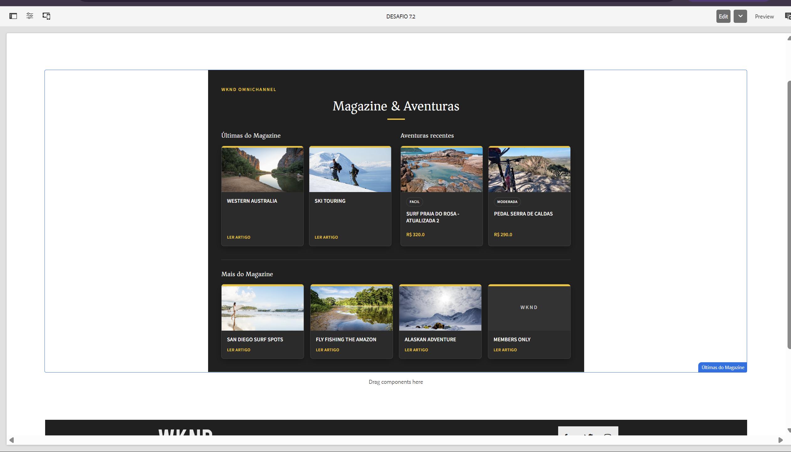
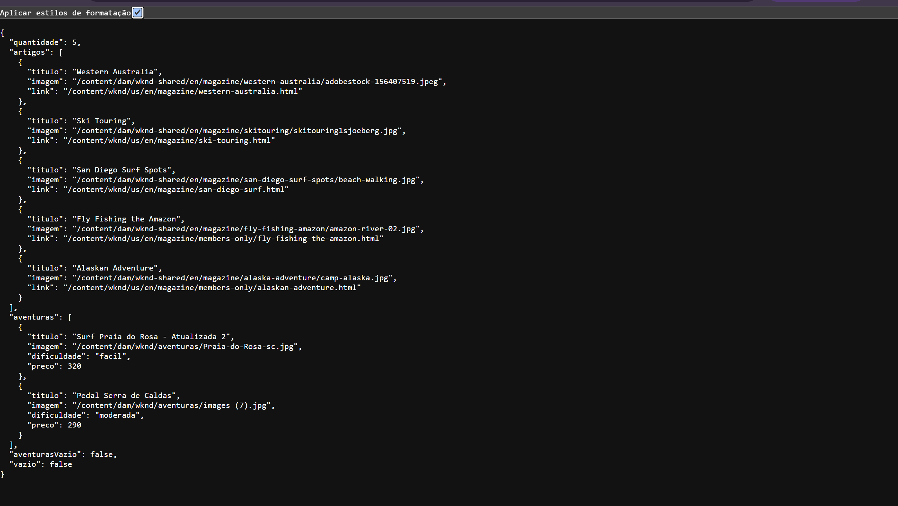
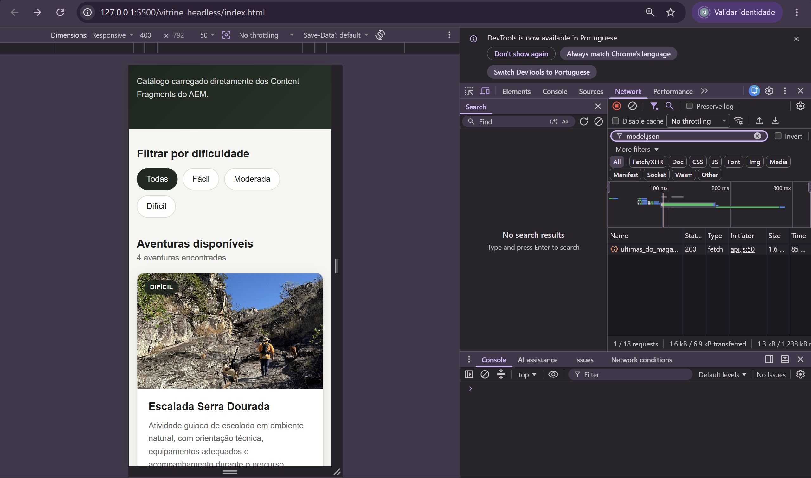
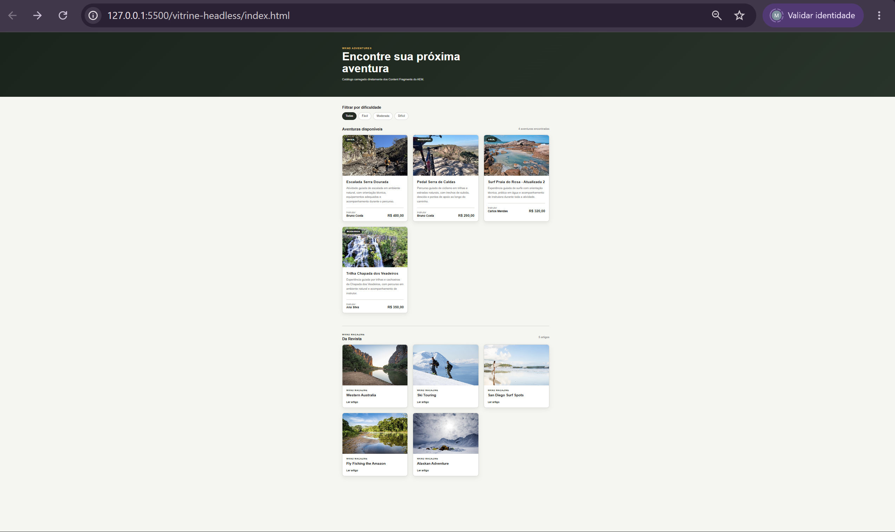

# Desafio-mestre — WKND Omnichannel

## Resumo

Implementação do desafio-mestre opcional da Sprint 4, conectando as entregas dos desafios **7.2, 8.1 e 8.2** em uma experiência Omnichannel.

A solução realiza a integração nos dois sentidos:

1. o componente **Últimas do Magazine** passa a consumir também as **2 aventuras mais recentes** criadas como Content Fragments;
2. a vitrine Headless passa a consumir o **Exporter JSON** do componente 7.2 por meio do bloco **Da Revista**.

Com isso, Pages e Content Fragments passam a coexistir no componente AEM, enquanto o conteúdo do componente também alimenta a aplicação externa.

---

## Checklist dos requisitos

### Requisitos do desafio-mestre

- [x] Utilizar o componente `ultimas-do-magazine` desenvolvido no desafio 7.2.
- [x] Exibir as **2 aventuras mais recentes** do catálogo criado no desafio 8.1.
- [x] Consumir aventuras armazenadas como **Content Fragments**.
- [x] Exibir **Pages e Content Fragments lado a lado** no mesmo componente full-stack.
- [x] Manter a listagem de artigos do Magazine já existente no componente 7.2.
- [x] Adicionar à vitrine do desafio 8.2 um bloco **Da Revista**.
- [x] Consumir no bloco `Da Revista` o **Exporter JSON do componente 7.2**.
- [x] Manter o fluxo de conteúdo nos dois sentidos:
  - Content Fragments alimentando o componente AEM;
  - componente AEM alimentando a aplicação Headless.

### Funcionalidades preservadas

- [x] Quantidade de artigos configurável pelo autor no AEM.
- [x] Style System com opções de **2, 3 e 4 colunas**.
- [x] Tema **Claro**.
- [x] Tema **Escuro**.
- [x] Tema **WKND**.
- [x] Layout responsivo.
- [x] Model Exporter `.model.json`.
- [x] Persisted Queries do catálogo de aventuras.
- [x] Filtro de aventuras por dificuldade.
- [x] Parâmetro de dificuldade enviado pela URL da Persisted Query.
- [x] Nenhuma query GraphQL construída diretamente no JavaScript da aplicação.

O desafio-mestre exige que o componente do 7.2 receba as duas aventuras mais recentes e que a vitrine do 8.2 consuma o Exporter JSON do componente, formando o fluxo Omnichannel nos dois sentidos. :contentReference[oaicite:0]{index=0}

---

# 1. Integração das aventuras ao componente AEM

O componente:

```text
wknd/components/ultimas-do-magazine
```

foi expandido para também consumir os Content Fragments armazenados em:

```text
/content/dam/wknd/aventuras
```

A consulta utiliza `QueryBuilder` e retorna somente:

```text
2 aventuras
```

ordenadas pela data de criação em ordem decrescente.

A quantidade é definida no código por:

```java
private static final int QUANTIDADE_AVENTURAS = 2;
```

---

## Modelo auxiliar de aventura

Foi criada a classe:

```text
AventuraResumo.java
```

responsável pelos dados utilizados na apresentação das aventuras:

```text
titulo
imagem
dificuldade
preco
```

Estrutura principal:

```text
core/
└── src/main/java/com/adobe/aem/guides/wknd/core/models/
    ├── ArtigoMagazine.java
    ├── AventuraResumo.java
    ├── UltimasDoMagazine.java
    └── impl/
        └── UltimasDoMagazineImpl.java
```

---

# 2. Componente WKND Omnichannel

O HTL do `ultimas-do-magazine` foi reorganizado para separar duas áreas.

## Destaques Omnichannel

No primeiro bloco são exibidos:

```text
2 artigos recentes  +  2 aventuras recentes
```

Estrutura visual:

```text
Últimas do Magazine                 Aventuras recentes

┌───────────┐ ┌───────────┐       ┌───────────┐ ┌───────────┐
│ artigo 1  │ │ artigo 2  │       │ aventura1 │ │ aventura2 │
└───────────┘ └───────────┘       └───────────┘ └───────────┘
```

Assim, conteúdo baseado em **Pages** e conteúdo baseado em **Content Fragments** são exibidos lado a lado no mesmo componente.

---

## Mais do Magazine

Os demais artigos continuam sendo apresentados separadamente em:

```text
Mais do Magazine
```

Essa área mantém o Style System original do desafio 7.2.

Exemplo:

```text
2 colunas
3 colunas
4 colunas
```

A integração com as aventuras não interfere na escolha de colunas dos demais artigos.

---

# 3. Style System preservado

Após a integração Omnichannel foram testadas as opções:

- [x] 2 colunas
- [x] 3 colunas
- [x] 4 colunas

Também foram mantidos os três temas existentes:

- [x] Claro
- [x] Escuro
- [x] WKND

Os cards de artigos e aventuras compartilham a mesma base visual para manter:

- tamanho consistente;
- proporção de imagem padronizada;
- bordas;
- sombras;
- hover;
- responsividade.

---

# 4. Model Exporter

O Sling Model continua exposto através do Model Exporter:

```java
@Exporter(
    name = ExporterConstants.SLING_MODEL_EXPORTER_NAME,
    extensions = ExporterConstants.SLING_MODEL_EXTENSION
)
```

O `.model.json` passou a retornar tanto os artigos quanto as aventuras.

Exemplo simplificado:

```json
{
  "quantidade": 5,
  "artigos": [
    {
      "titulo": "Western Australia",
      "imagem": "/content/dam/...",
      "link": "/content/wknd/..."
    }
  ],
  "aventuras": [
    {
      "titulo": "Surf Praia do Rosa - Atualizada 2",
      "imagem": "/content/dam/wknd/aventuras/...",
      "dificuldade": "facil",
      "preco": 320
    },
    {
      "titulo": "Pedal Serra de Caldas",
      "imagem": "/content/dam/wknd/aventuras/...",
      "dificuldade": "moderada",
      "preco": 290
    }
  ],
  "aventurasVazio": false,
  "vazio": false
}
```

---

# 5. Bloco "Da Revista" na vitrine Headless

A aplicação criada no desafio 8.2 foi ampliada com a seção:

```text
Da Revista
```

Essa seção utiliza uma fonte diferente das aventuras.

## Aventuras

```text
Persisted Query GraphQL
        ↓
Content Fragments
        ↓
fetchAdventures()
```

## Da Revista

```text
Componente Últimas do Magazine
        ↓
Sling Model Exporter
        ↓
.model.json
        ↓
fetchMagazineArticles()
        ↓
Da Revista
```

Portanto, o bloco `Da Revista` **não utiliza GraphQL** para buscar seus artigos.

Ele reutiliza diretamente os dados expostos pelo componente AEM.

---

# 6. Estrutura da aplicação Headless

A aplicação continua sem framework e com responsabilidades separadas:

```text
vitrine-headless/
├── index.html
├── css/
│   ├── variables.css
│   └── styles.css
└── js/
    ├── config.js
    ├── api.js
    ├── app.js
    └── components.js
```

## `config.js`

Centraliza:

- host do AEM;
- Persisted Queries;
- endpoint do Model Exporter;
- labels de dificuldade.

## `api.js`

Responsável pela comunicação com o AEM:

```text
fetchAdventures()
→ Persisted Queries GraphQL

fetchMagazineArticles()
→ Model Exporter .model.json
```

## `components.js`

Responsável pela criação dos cards:

```text
createAdventureCard()
createMagazineCard()
```

Também contém funções auxiliares para:

- escapar conteúdo recebido;
- formatar preço;
- construir URLs de recursos do AEM.

## `app.js`

Responsável por:

- carregamento inicial;
- renderização;
- filtros;
- estados de carregamento;
- estados de erro;
- atualização da quantidade de resultados.

---

# 7. Persisted Queries preservadas

A integração Omnichannel não altera a arquitetura Headless desenvolvida no desafio 8.2.

As aventuras continuam sendo consumidas através de:

```text
/graphql/execute.json/wknd/aventurasList
```

e:

```text
/graphql/execute.json/wknd/aventurasListDificuldade
```

Quando existe filtro, o parâmetro é enviado na URL:

```text
;dificuldade=moderada
```

Exemplo:

```text
/graphql/execute.json/wknd/aventurasListDificuldade;dificuldade=moderada
```

A aplicação não monta strings GraphQL no cliente.

---

# 8. CORS

A política CORS foi expandida para permitir o acesso da aplicação externa ao Model Exporter utilizado pelo desafio.

Foi liberado especificamente:

```text
/content/wknd/us/en/desafio-7-2/.*\.model\.json
```

As rotas já utilizadas pelo GraphQL foram preservadas:

```text
/graphql/execute.json.*
```

A aplicação local utiliza:

```text
http://127.0.0.1:5500
```

e o AEM Author:

```text
http://127.0.0.1:4502
```

---

# 9. Comportamento dinâmico

A quantidade de artigos permanece configurável pelo Dialog do componente `Últimas do Magazine`.

Durante os testes foi alterada a quantidade no AEM e a aplicação externa refletiu a mudança através do Model Exporter.

Exemplo validado:

```text
AEM
quantidade = 1
      ↓
.model.json
      ↓
Da Revista
1 artigo
```

Depois:

```text
AEM
quantidade = 5
      ↓
.model.json
      ↓
Da Revista
5 artigos
```

Isso demonstra que os artigos exibidos pela aplicação não estão hardcoded no front-end.

---

# 10. Fluxo Omnichannel final

A arquitetura final funciona nos dois sentidos.

## Content Fragments entrando no site

```text
Content Fragments de Aventura
          ↓
QueryBuilder
          ↓
UltimasDoMagazineImpl
          ↓
Componente AEM
          ↓
Pages + Fragments
```

## Componente alimentando a aplicação

```text
Pages do Magazine
        ↓
UltimasDoMagazineImpl
        ↓
Sling Model Exporter
        ↓
.model.json
        ↓
Vitrine Headless
        ↓
Da Revista
```

Resultado:

```text
            AEM

Content Fragments ───────► Componente
                              │
Pages ────────────────────────┤
                              │
                              ▼
                       Model Exporter
                              │
                              ▼
                     Aplicação Headless
```

---

# 11. Evidências

## AEM — Pages + Content Fragments



Comprova a exibição conjunta de artigos do Magazine e das duas aventuras mais recentes no componente AEM.

---

## Exporter JSON



Comprova que o Sling Model Exporter retorna os dados utilizados na integração.

---

## Network — Model Exporter



Comprova a requisição da aplicação externa ao `.model.json`.

A chamada foi validada com:

```text
Status: 200
Type: fetch
```

---

## Vitrine com Da Revista



Comprova a aplicação Headless apresentando:

- catálogo de aventuras;
- filtros;
- bloco `Da Revista`.

---

## Demonstração em vídeo

Arquivo:

```text
EXTRA-demonstracao-conexao.mp4
```

Demonstra a integração entre o conteúdo administrado no AEM e a experiência externa.

---

# 12. Validações finais

## Componente AEM

- [x] Artigos do Magazine carregados.
- [x] Duas aventuras recentes carregadas.
- [x] Pages e Content Fragments apresentados juntos.
- [x] Cards de artigos e aventuras padronizados.
- [x] Quantidade de artigos configurável.
- [x] 2 colunas funcionais.
- [x] 3 colunas funcionais.
- [x] 4 colunas funcionais.
- [x] Tema Claro funcional.
- [x] Tema Escuro funcional.
- [x] Tema WKND funcional.
- [x] Layout responsivo.
- [x] Model Exporter funcional.

## Vitrine Headless

- [x] Aventuras carregadas pelo AEM.
- [x] Persisted Query sem filtro funcional.
- [x] Persisted Query parametrizada funcional.
- [x] Filtro por dificuldade funcional.
- [x] Imagens das aventuras carregadas.
- [x] Instrutor carregado.
- [x] Preço carregado.
- [x] Bloco `Da Revista` funcional.
- [x] Artigos recebidos através do `.model.json`.
- [x] Alterações realizadas no AEM refletidas no bloco `Da Revista`.
- [x] Layout mobile-first preservado.
- [x] CORS funcional.

---

# 13. Commits

Commits principais da implementação:

```text
feat: integra aventuras ao ultimas do magazine
feat: integra magazine a vitrine headless
chore: ajusta cors para model exporter
```

A documentação e as evidências são versionadas separadamente em commit `docs`.

---

# Resultado

O desafio-mestre conecta as implementações anteriores em uma única experiência Omnichannel.

O componente AEM combina conteúdo proveniente de **Pages** e **Content Fragments**, enquanto seu próprio **Model Exporter** fornece conteúdo para a aplicação Headless externa.

Dessa forma, o conteúdo flui nos dois sentidos:

```text
Fragments → componente AEM
componente AEM → aplicação Headless
```

cumprindo o objetivo do desafio **WKND Omnichannel**.